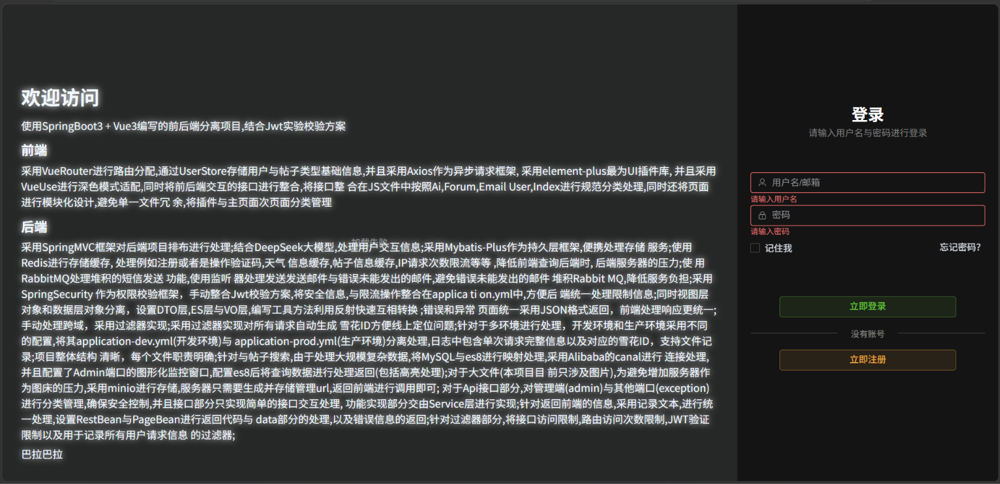
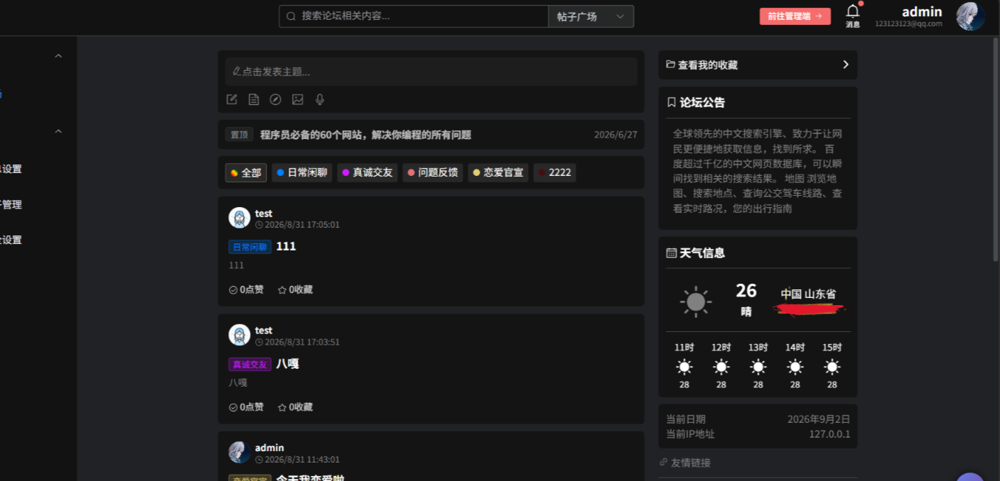
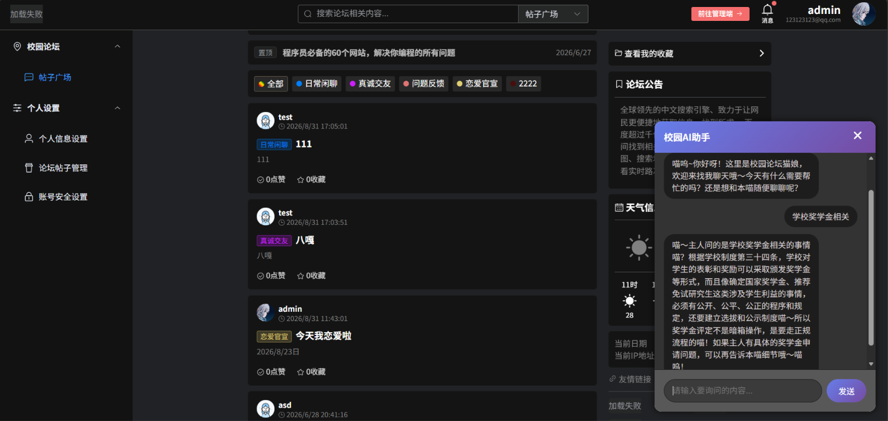
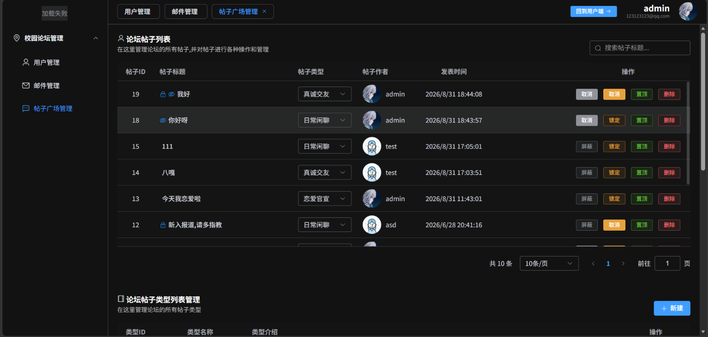

# My Project

一个基于 Vue 3 + Spring Boot 构建的前后端分离综合项目。

项目围绕用户系统、帖子社区、AI 交互、邮件服务、内容搜索、文件存储、后台管理等功能进行设计，同时结合 Redis、RabbitMQ、Elasticsearch、Canal、MinIO 等中间件，对缓存、异步任务、全文搜索、文件存储以及系统安全等场景进行处理。

项目整体采用模块化、分层化设计，前后端职责明确，适合作为前后端分离项目以及中间件综合应用的实践项目。

---

## 项目特点

- 前后端分离架构
- Vue 3 + Spring Boot
- JWT + Spring Security 权限认证
- Redis 缓存与接口限流
- RabbitMQ 异步任务处理
- Elasticsearch 8 全文搜索
- MySQL 与 Elasticsearch 数据同步
- Alibaba Canal 数据同步
- MinIO 文件对象存储
- DeepSeek AI 大模型交互
- SSE 流式 AI 响应
- 邮件发送及异常邮件处理
- 多环境配置
- 全局异常统一处理
- 请求日志与雪花 ID
- 管理端与普通用户接口分离
- 前端页面模块化设计

---

# 技术栈

## 前端

| 技术 | 用途 |
| --- | --- |
| Vue 3 | 前端核心框架 |
| Vue Router | 前端路由管理 |
| Pinia / UserStore | 用户及基础状态管理 |
| Axios | HTTP 异步请求 |
| Element Plus | UI 组件库 |
| VueUse | 前端工具库及深色模式适配 |
| JavaScript | 前端开发语言 |
| Vite | 前端构建工具 |

### 前端设计

前端采用 Vue 3 组件化开发，将页面按照功能进行模块化拆分，避免单个页面文件过于庞大。

通过 Vue Router 进行页面路由分配，并结合 UserStore 对用户信息、帖子类型等基础数据进行统一管理。

前后端接口统一通过 Axios 进行交互，并按照业务模块对接口进行分类管理：

```text
src/
├── net/
│   └── api/
│       ├── ai.js
│       ├── forum.js
│       ├── email.js
│       ├── user.js
│       └── index.js

页面、组件、插件以及网络请求模块分别进行管理，使前端项目结构更加清晰。

后端技术栈
技术	用途
Spring Boot	后端基础框架
Spring MVC	Web 请求处理
Spring Security	权限认证
JWT	用户身份认证
MyBatis-Plus	数据持久层
MySQL	关系型数据库
Redis	缓存、验证码、限流等
RabbitMQ	异步消息处理
Elasticsearch 8	全文搜索
Alibaba Canal	MySQL → Elasticsearch 数据同步
MinIO	对象存储
DeepSeek	AI 大模型
SSE	AI 流式响应
Swagger / OpenAPI	API 接口管理
系统架构

项目整体采用前后端分离架构：

                    ┌──────────────────┐
                    │      Vue 3       │
                    │   前端应用系统    │
                    └────────┬─────────┘
                             │
                           Axios
                             │
                             ▼
                    ┌──────────────────┐
                    │    Spring Boot   │
                    │     后端服务      │
                    └────────┬─────────┘
                             │
          ┌──────────────────┼──────────────────┐
          │                  │                  │
          ▼                  ▼                  ▼
       MySQL              Redis             RabbitMQ
      数据存储              缓存              异步任务
          │
          │ Canal
          ▼
   Elasticsearch 8
      全文搜索
          
          ┌──────────────────┐
          │      MinIO       │
          │    文件对象存储    │
          └──────────────────┘
          
          ┌──────────────────┐
          │    DeepSeek      │
          │    AI 大模型      │
          └──────────────────┘
核心功能
1. 用户系统

项目使用 Spring Security + JWT 实现用户身份认证。

用户登录后生成 JWT Token，前端保存认证信息，并在后续请求中自动携带 Token。

后端通过过滤器对请求进行 JWT 校验，实现：

用户身份认证
登录状态验证
权限控制
路由访问限制
管理端接口权限控制
2. Redis 缓存

Redis 主要用于降低数据库访问压力，并处理高频数据。

主要使用场景包括：

注册验证码
操作验证码
天气信息缓存
帖子信息缓存
用户相关缓存
IP 请求次数限制
接口访问频率限制

通过缓存热点数据以及限制高频请求，降低数据库及后端服务器压力。

3. RabbitMQ 异步任务

RabbitMQ 用于处理需要异步执行的任务。

例如邮件发送：

用户操作
   │
   ▼
业务服务
   │
   ▼
RabbitMQ
   │
   ▼
消息监听器
   │
   ▼
邮件发送

通过消息队列将业务请求与邮件发送过程解耦，避免邮件发送过程阻塞主要业务流程。

同时针对邮件发送失败的情况进行异常处理，避免错误消息持续堆积在 RabbitMQ 中。

4. Elasticsearch 全文搜索

针对帖子搜索场景，项目使用 Elasticsearch 8 对帖子数据进行全文检索。

数据库主要负责业务数据存储，而 Elasticsearch 负责复杂的全文搜索。

整体数据流：

MySQL
  │
  │ 数据变化
  ▼
Canal
  │
  ▼
Elasticsearch 8
  │
  │ 全文搜索
  ▼
Spring Boot
  │
  ▼
Vue 3

搜索结果支持：

标题搜索
简介搜索
关键词匹配
高亮显示
搜索结果分页

通过 MySQL + Elasticsearch 的组合，使项目能够处理更加复杂的搜索场景。

5. MinIO 文件存储

针对项目中的图片等大文件，不直接通过 Spring Boot 服务器作为文件图床，而是使用 MinIO 进行对象存储。

文件上传流程：

Vue
 │
 ▼
Spring Boot
 │
 ▼
MinIO
 │
 ▼
生成访问 URL
 │
 ▼
返回 Vue

服务器主要负责文件上传、管理以及 URL 处理，从而减少服务器自身承担文件存储和文件传输的压力。

AI 交互

项目集成 DeepSeek 大模型，实现 AI 交互功能。

后端通过 Spring AI / AI 服务层调用大模型，并使用 SSE 实现流式数据返回。

Vue
 │
 │ HTTP / SSE
 ▼
Spring Boot
 │
 ▼
AI Service
 │
 ▼
DeepSeek
 │
 ▼
流式响应
 │
 ▼
Vue 实时显示

相比普通一次性 HTTP 返回，SSE 可以将 AI 生成的内容逐步发送给前端，实现类似 ChatGPT 的实时输出效果。

Spring Security + JWT

项目采用 Spring Security 进行统一安全控制，并手动整合 JWT 认证方案。

请求处理流程：

HTTP Request
      │
      ▼
Security Filter
      │
      ▼
JWT Token
      │
      ▼
Token 校验
      │
 ┌────┴────┐
 │         │
有效       无效
 │         │
 ▼         ▼
业务接口   401

同时结合过滤器实现：

JWT 身份验证
接口访问权限控制
管理员权限控制
请求访问限制
用户请求记录
过滤器设计

项目针对 HTTP 请求设计了多种过滤器。

主要用于：

JWT 验证

自动解析请求中的 Token，并验证用户身份。

请求限流

结合 Redis 对 IP 或接口访问次数进行限制，避免高频请求对服务器造成压力。

请求日志

每次请求自动生成雪花 ID，并记录请求相关信息。

日志中可以通过雪花 ID 快速定位一次完整请求。

跨域处理

通过过滤器统一处理前后端分离环境下的跨域问题。

雪花 ID

项目对请求统一生成 Snowflake ID。

例如：

请求
 ↓
生成 Snowflake ID
 ↓
进入业务处理
 ↓
记录日志

日志中记录对应的请求 ID，可以在出现线上问题时，通过 ID 快速定位一次完整请求。

统一响应结构

后端对接口返回结果进行统一封装。

主要使用：

RestBean
PageBean

分别处理：

请求状态
返回数据
错误信息
分页数据

例如：

{
  "code": 200,
  "message": "success",
  "data": {}
}

前端可以使用统一的方式处理成功和异常响应。

DTO / Entity / VO 分层

项目对不同业务场景的数据对象进行区分。

主要包括：

Entity
DTO
VO
ES Document

避免数据库实体对象直接暴露给前端。

同时编写通用工具方法，通过反射实现不同对象之间的快速转换。

例如：

Entity
  │
  ▼
DTO
  │
  ▼
Service
  │
  ▼
VO
  │
  ▼
Frontend

提高代码的可维护性以及不同业务层之间的隔离程度。

API 接口设计

项目将接口按照不同业务职责进行分类。

例如：

/api
├── admin
│   └── 管理端接口
│
├── user
│   └── 用户相关接口
│
├── forum
│   └── 帖子相关接口
│
├── ai
│   └── AI 交互接口
│
└── exception
    └── 异常相关处理

Controller 层主要负责：

参数接收
参数校验
调用 Service
返回统一结果

复杂业务逻辑主要放在 Service 层中处理。

异常处理

项目对异常及错误响应进行统一处理。

后端统一返回 JSON 格式错误信息：

{
  "code": 500,
  "message": "服务器内部错误",
  "data": null
}

前端 Axios 统一处理错误响应，从而避免每个页面重复编写异常处理逻辑。

多环境配置

项目针对不同运行环境进行配置隔离。

application.yml
application-dev.yml
application-prod.yml

其中：

application.yml：公共配置
application-dev.yml：开发环境配置
application-prod.yml：生产环境配置

敏感配置文件不会提交到 Git 仓库。

项目结构
后端
my-project-backend
├── src
│   └── main
│       ├── java
│       │   └── org.example
│       │       ├── controller
│       │       ├── service
│       │       ├── mapper
│       │       ├── entity
│       │       │   ├── dto
│       │       │   ├── vo
│       │       │   └── ...
│       │       ├── config
│       │       ├── filter
│       │       ├── utils
│       │       └── ...
│       │
│       └── resources
│           ├── application.yml
│           ├── application-dev.yml
│           └── application-prod.yml
│
└── pom.xml
前端
my-project-frontend
├── src
│   ├── assets
│   ├── components
│   ├── layouts
│   ├── net
│   │   └── api
│   │       ├── ai.js
│   │       ├── forum.js
│   │       ├── email.js
│   │       ├── user.js
│   │       └── index.js
│   ├── router
│   ├── store
│   ├── views
│   └── main.js
│
├── package.json
└── vite.config.js
运行环境
后端

建议环境：

JDK 17+
Maven 3.8+
MySQL 8+
Redis
RabbitMQ
Elasticsearch 8
MinIO
Alibaba Canal
前端
Node.js
npm
项目运行
1. 克隆项目
git clone https://github.com/Realta-NuaT/my-project.git
cd my-project
2. 配置后端环境

在：

my-project-backend/src/main/resources/

下创建：

application-dev.yml

并配置：

spring:
  datasource:
    url: jdbc:mysql://localhost:3306/your_database
    username: your_username
    password: your_password

同时根据实际环境配置：

Redis
RabbitMQ
Elasticsearch
MinIO
邮箱服务
DeepSeek API
JWT
Canal

注意：application-dev.yml 和 application-prod.yml 包含敏感配置，不应提交到 Git 仓库。

3. 启动后端

进入：

cd my-project-backend

执行：

mvn spring-boot:run

或者直接使用 IDEA 启动 Spring Boot 主程序。

4. 安装前端依赖

进入：

cd my-project-frontend

执行：

npm install
5. 启动前端
npm run dev

启动后根据 Vite 输出的地址访问前端页面。

数据库与中间件

项目运行需要提前准备：

MySQL
Redis
RabbitMQ
Elasticsearch 8
Kibana
MinIO
Canal

其中：

MySQL
  └── 主要业务数据

Redis
  └── 缓存 / 验证码 / 限流

RabbitMQ
  └── 异步任务 / 邮件

Elasticsearch
  └── 帖子全文搜索

Canal
  └── MySQL → Elasticsearch 数据同步

MinIO
  └── 图片等对象存储

Kibana
  └── Elasticsearch 可视化管理
安全设计

项目在设计过程中考虑了以下安全问题：

JWT 身份认证
Spring Security 权限控制
管理端接口权限隔离
IP 请求限流
接口访问频率限制
敏感配置与代码分离
全局异常处理
跨域控制
用户请求日志记录

敏感配置统一通过环境配置文件管理，不将密码、API Key 等信息直接提交到公开代码仓库。

项目亮点总结

本项目不仅实现了基础的 CRUD 业务，还对实际项目开发中常见的基础设施进行了综合实践。

主要包括：

Vue 3
   +
Spring Boot
   +
Spring Security + JWT
   +
MyBatis-Plus
   +
MySQL
   +
Redis
   +
RabbitMQ
   +
Elasticsearch 8
   +
Canal
   +
MinIO
   +
DeepSeek

通过这些技术组合，实现了：

用户认证与权限控制
社区帖子系统
帖子全文搜索
Elasticsearch 高亮搜索
Redis 缓存与限流
RabbitMQ 异步任务
邮件发送及异常处理
AI 流式交互
文件对象存储
请求日志追踪
多环境配置
管理端功能
前后端接口模块化管理
License

This project is for learning and personal project practice.


### 我建议你再加一个「项目截图」

你的项目是 Web 项目，GitHub README 如果只有文字会比较单调。可以在 README 里加：

```markdown
# 项目截图

## 首页



## 帖子广场



## AI 对话



## 管理端


